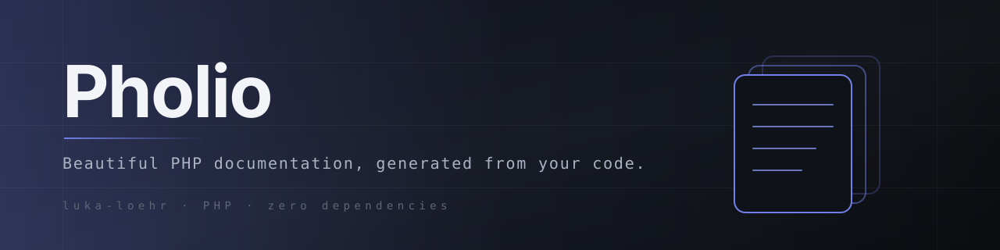

[](LICENSE)
[](https://www.php.net/releases/8.2/en.php)
[](#2-system)
[](docs/roadmap.md)

**Beautiful PHP documentation, generated from your code.**

I wanted a documentation site that looks and behaves exactly like the Fumadocs
Notebook theme, without Node, npm, Composer or a framework in the repository.
So I rebuilt the theme in plain PHP, CSS and JavaScript, and then I wrote the
tooling that proves the rebuild is the same page rather than a resemblance: the
same element tree, the same computed styles, the same pixels, the same keyboard
behaviour. It was built for a real documentation site first, and Pholio is that
generator made to stand on its own.

> **Pre-release.** The generator, theme, tests and verification tooling are
> here, and `php bin/pholio build` builds the demo site. The content format
> and the configuration schema are settled; version 0.1.0 is not tagged yet.
> See [`docs/roadmap.md`](docs/roadmap.md).

## 1. What it does

Point Pholio at a folder of Markdown files and one configuration file. It
writes a finished static site: one HTML file per page, one stylesheet, a set
of small JavaScript modules, the fonts, a search index, and an Apache
`.htaccess` with security headers and the redirects for whatever URLs you are
leaving behind. Deploy it by copying the files.

- **Markdown plus component tags.** A strict subset of Markdown and the
  Notebook component catalogue as declarative tags: callouts, cards, tabs,
  accordions, steps, file trees, type tables and more. Tags carry attributes
  and nest. They never import or evaluate anything.
- **No dependencies.** No Composer, no npm, nothing to install. The only
  external ingredients are vendored assets that ship with their licences.
- **PHP at build time only.** The output is static HTML. No PHP runs in
  production.
- **Fail loud.** An unknown construct, component, icon or code language, an
  invalid `meta.json` or a duplicate slug stops the build with file and line.
  There is no silent fallback.
- **Search without a backend.** The index is built at compile time; ranking runs
  in the browser with the same parameters as the reference, so the results and
  their order match.

## 2. System

Markdown goes in, static HTML comes out, and the output is held to a standard
that can be measured.

The target is the Fumadocs Notebook theme, frozen once as a reference build.
Being "the same" then means four things, checked in order, all of which must be
green:

| Stage | What is compared |
| --- | --- |
| **Golden DOM** | Element tree and every attribute, after normalising framework noise and mapping class names through a translation table |
| **Computed styles** | About 70 CSS properties per element, at three widths, light and dark, including hovered and focused states |
| **Pixels** | Full-page screenshots per page, width and scheme, zero tolerance outside a text-antialiasing mask, including open dialogs, drawers and popovers |
| **Behaviour** | Attribute order frame by frame while animating, `getAnimations()` keyframes, focus order, hotkeys, scroll locking, and the result lists for a fixed query set |

That is the whole idea of the project: the resemblance is not asserted in a
README, it is a diff that either is empty or is not. The checks run in three
tiers, from plain PHP to a full browser comparison against a reference export;
see [`docs/verification.md`](docs/verification.md).

## 3. Architecture

```
 pholio.config.php          validated and normalised by Config.php
 content/**                 Markdown + one meta.json per folder
     |
     v
 +-------------------------------------------------------------+
 |  tree          lib/Tree.php         meta.json -> page tree   |
 |  parser        lib/Markdown.php     strict grammar -> AST    |
 |  ids/toc       lib/Ids.php Toc.php  headings -> ids, toc     |
 |  highlight     lib/Highlight.php    TextMate grammars        |
 |  index         lib/SearchIndex.php  blocks -> search docs    |
 +-------------------------------------------------------------+
     |
     v
 +-------------------------------------------------------------+
 |  render        lib/Render.php       AST -> components        |
 |  components    components/*.php     pure functions           |
 |  templates     templates/document.php   the html shell       |
 +-------------------------------------------------------------+
     |
     v
 output_dir/**              index.html per page, assets, search-index.json, .htaccess
```

Each stage is a pure transformation. Only the tree, the parser and the image
sizes read the filesystem and only the builder writes it, which is what makes
`pholio check` possible: rebuild into a temporary directory, diff, refuse
anything stale.

| Path | Contents |
| --- | --- |
| `bin/pholio` | CLI entry point |
| `src/` | The generator: CLI, config, builder, `lib/`, `components/`, `templates/`, `i18n/` |
| `theme/` | `css/`, `js/`, `fonts/` |
| `vendor-data/` | Shiki grammars and themes, lucide icon data |
| `licenses/` | Licence texts of the vendored material |
| `verify/` | Node development tooling for the four stages, never shipped |
| `tests/` | PHP tests and the demo snapshot |
| `docs/` | This project's own documentation, written in Pholio's format |
| `docs/assets/` | Banner and other repository images |
| `examples/demo/` | A demo site covering every component |
| `scripts/` | Local checks, run by hand |
| `pholio.config.example.php` | Every configuration key with comments |

## 4. Requirements

| Requirement | Why |
| --- | --- |
| **PHP 8.2 or newer**, CLI | The generator runs once per build. Nothing runs on the server |
| **PCRE2 10.43 or newer** (bundled with PHP; check with `php -r 'echo PCRE_VERSION;'`) | The syntax highlighter runs TextMate grammars, whose patterns are written for Oniguruma. Pholio translates them to PCRE2. Some of them use lookbehinds of variable length, which PCRE2 supports only from 10.43. On older versions those few patterns are switched off with a warning, and highlighting no longer matches the reference exactly |
| **`mbstring` and `ctype`** | Unicode-aware slugs, case folding and tokenisation. Both are enabled in almost every PHP build |
| **Apache**, optional | Only for the generated `.htaccess`. Any static file server works; pages then need their `x/index.html` served for the URL `x` |

That is the complete list: no Composer, no npm, no network access during a
build. Node is needed only for the optional comparison tooling in `verify/`.

## 5. Credits

Pholio stands on other people's work. It reproduces the
[Fumadocs](https://github.com/fuma-nama/fumadocs) Notebook theme and follows the
state-attribute contract of [Base UI](https://github.com/mui/base-ui). Its CSS
values come from [Tailwind CSS](https://github.com/tailwindlabs/tailwindcss)
output, and its search ranking follows
[zbsearch](https://github.com/micheleriva/zbsearch). It ships
[Inter](https://github.com/rsms/inter), [lucide](https://github.com/lucide-icons/lucide)
icons, and TextMate grammars and GitHub themes as packaged by
[Shiki](https://github.com/shikijs/shiki).

Exact versions, upstream commits, copyright holders and the verbatim licence
texts are in [`THIRD_PARTY_NOTICES.md`](THIRD_PARTY_NOTICES.md) and
[`licenses/`](licenses/).

## 6. Quickstart

The fastest way to see the format is the demo site in
[`examples/demo/`](examples/demo/): eleven pages documenting a fictional tool,
covering every component and Markdown extra. From the repository root:

```bash
php bin/pholio build --config examples/demo/pholio.config.php
./scripts/serve-demo.sh        # http://127.0.0.1:8080, rebuilds on changes
```

For your own project:

```bash
# 1. Bring Pholio into your project
git clone https://github.com/luka-loehr/pholio.git vendor/pholio

# 2. Start from the example configuration
cp vendor/pholio/pholio.config.example.php docs.config.php

# 3. Build, or serve while you write
php vendor/pholio/bin/pholio build --config docs.config.php
php vendor/pholio/bin/pholio dev --config docs.config.php
```

| Command | Effect |
| --- | --- |
| `pholio build` | Render the site into `output_dir`. `--only <url-part>` renders matching pages, `--dev` includes drafts (`_name.md`), `--out`, `--content` and `--set key=value` override the config |
| `pholio check` | Render into a temporary directory and diff against `--against` (default `output_dir`); prints `missing:`, `stale:` and `extra:` lines |
| `pholio dev` | Build with drafts, serve with PHP's built-in server (`--host`, `--port`), rebuild on changes (`--no-watch` to turn off) |
| `--config <file>`, `--profile <name>` | Configuration file (default `./pholio.config.php`) and a profile merged over it |

| Exit code | Meaning |
| --- | --- |
| `0` | Success; `check` found no difference |
| `1` | `check` found differences |
| `2` | Usage or configuration error: unknown flag or key, planned key, invalid value, missing file |
| `3` | Content error, printed as `pholio: <file>:<line>: <message>` |
| `4` | I/O error |
| `70` | Internal error; `PHOLIO_DEBUG=1` prints the stack trace |

Requirements are in [section 4](#4-requirements), every command and flag in
[`docs/getting-started.md`](docs/getting-started.md).

## 7. Content format

Frontmatter with `title`, optional `description`, `heading`, `icon`, `full` and
`updated`. Then a fixed Markdown subset: `##` to `####`, paragraphs, bold,
italic, strikethrough, inline code, links, images, nested and task lists, GitHub
tables with alignment, footnotes, blockquotes, rules, and hard breaks from two
trailing spaces. Heading ids follow `github-slugger`, duplicates included.
Fenced code is highlighted at build time for the bundled languages, with
titles, line numbers, notation comments and code tabs.

Component tags sit on their own line with quoted attributes:

```markdown
<Callout type="warning" title="Before you start">
Back up your configuration.
</Callout>

<Tabs items="macOS|Linux" groupId="os" persist>
<Tab value="macOS">
Archives live in `~/Library/Application Support`.
</Tab>
<Tab value="Linux">
Archives live in `~/.local/share`.
</Tab>
</Tabs>

<Screenshot src="/images/export.webp" dark="/images/export-dark.webp" alt="The export dialog" />
```

| Tag | Attributes |
| --- | --- |
| `Callout` | `type` (`info`, `warning`, `error`, `success`, `idea`; `warn` and `tip` are aliases), `title`, `icon` |
| `Cards` / `Card` | `title`, `description`, `href`, `icon` |
| `Screenshot`, `ImageZoom` | `src`, `alt`; `dark` for the dark-scheme image, `width` and `height` for zoom |
| `Banner` | `id`, `variant`, `height`, `changeLayout` |
| `Tabs` / `Tab` | `items`, `groupId`, `persist`, `updateAnchor`, `defaultIndex`, `label`; `value` |
| `Accordions` / `Accordion` | `type`, `defaultValue`; `title`, `id`, `value` |
| `Steps` / `Step`, `Files` / `Folder` / `File` | `name`, `defaultOpen`, `disabled`, `icon` |
| `TypeTable` / `TypeProp` | `name`, `type`, `default`, `typeDescription`, `typeDescriptionLink`, `required`, `deprecated` |
| `InlineTOC`, `DynamicCodeBlock` | `label`; `lang` |

The full grammar, including `meta.json`, is in
[`docs/content-format.md`](docs/content-format.md).

## 8. Configuration

One PHP file returning one array, validated before anything is built. Full
reference in [`docs/configuration.md`](docs/configuration.md); the example file
carries every key as comments. Paths are relative to the config file.

| Key | Default | Meaning |
| --- | --- | --- |
| `title` | required | Header wordmark, `<title>`, search dialog |
| `content_dir`, `output_dir` | required | Markdown sources, and where the site is written |
| `logo` | `null` | Logo URL, rendered 24px |
| `base_path`, `docs_path` | `/`, `null` | URL of the start page and of the docs root |
| `asset_base` | `assets/` | Where CSS, JS and fonts are served from |
| `language` | `en` | `<html lang>`, UI strings (`en`, `de`), default search tokenizer |
| `translations` | `[]` | Single UI string overrides |
| `content.link_prefix` | `null` | Internal link prefix in the content rewritten to the docs root |
| `content.asset_prefix`, `content.asset_target`, `content.asset_root` | `null`, `{docs}`, `null` | Image URL rewriting and where image sizes are read |
| `copy` | `[]` | Directories copied into the output |
| `nav` | `[]` | Header links: `title`, `href`, `active`, `external` |
| `home` | `null` | Start page: hero kicker, headline, lead, images, buttons, and the area cards |
| `theme.light`, `theme.dark`, `theme.palette_css` | built-in | Colour tokens without `--color-fd-`, written at the `@pholio:palette` marker |
| `head` | none | Favicons, manifest, theme colour |
| `search.tokenizer` | follows `language` | `english` or `german`; neither stems |
| `redirects`, `redirects_file` | `[]`, `null` | Old path to new path, emitted as 301 rules in `.htaccess` |
| `server.htaccess`, `server.csp` | `true`, strict | The generated `.htaccess` and its Content-Security-Policy |
| `profiles` | `[]` | Partial configs merged in with `--profile` |

Planned and rejected with `planned: <key>` until implemented: `base_url`,
`theme.default_scheme`, `theme.custom_css`, `search.enabled`, `nav[].icon`,
`nav[].icon_only`, `slots`, `components`, `strict_content`.

## 9. Decision record

- **2026-09-12 — The name is Pholio.** The generator stopped being an internal
  build step of one documentation site and became a product with its own
  repository, its own name and its own branding.
- **2026-09-12 — Markdown plus component tags, not MDX.** MDX buys expressions
  and imports, and pays with a compiler, a component runtime and content that
  can execute. Tags are data: attributes and nesting, nothing else. New tags are
  registered in PHP, where code is supposed to live.
- **2026-09-12 — No extraction from source code.** No docblock parsing, no API
  reference generation. Generated reference pages are the part of a
  documentation site nobody reads and everybody stops maintaining. Pholio
  renders what you wrote.
- **2026-09-12 — PHP at build time only.** The output is static files. The
  components are still pure functions and could render per request, but nothing
  in production depends on a PHP runtime.
- **2026-09-12 — Hand-written CSS derived from the compiled Tailwind output.**
  Keeping the 110 KB of compiled utility CSS would have been pixel-perfect on
  day one and unmaintainable on day two. Every value in the hand-written
  stylesheet comes from the compiled reference, and the computed-style diff is
  what keeps the claim honest.
- **2026-09-12 — Vanilla-JS ports of the Base UI primitives.** Dialog, popover,
  collapsible, scroll area and tabs are rebuilt as small classes that set the
  same state attributes in the same order, because the CSS and the animations
  depend on that order. Copying a React runtime to get five behaviours was not
  a trade worth making.
- **2026-09-12 — Four-stage verification.** DOM, computed styles, pixels,
  behaviour. A checklist review of a theme rebuild finds the differences you
  thought to look for. A diff finds the others.
- **2026-09-12 — One file per commit.** Long history, but every change is
  readable and revertible on its own. It has already paid for itself while
  moving code between repositories with `git subtree split`.

## 10. Docs map

| Document | What it covers |
| --- | --- |
| [`docs/index.md`](docs/index.md) | What Pholio is and what it deliberately is not |
| [`docs/getting-started.md`](docs/getting-started.md) | Requirements, install, the first page, commands, flags and exit codes |
| [`docs/content-format.md`](docs/content-format.md) | Frontmatter, the Markdown subset, every component tag |
| [`docs/configuration.md`](docs/configuration.md) | Every configuration key |
| [`docs/architecture.md`](docs/architecture.md) | The pipeline, the design rules, the known limits |
| [`docs/verification.md`](docs/verification.md) | The three test tiers, the demo snapshot, and the four comparison stages |
| [`docs/roadmap.md`](docs/roadmap.md) | Current state, next steps, non-goals |
| [`examples/demo/`](examples/demo/README.md) | The demo site, its component coverage table and build instructions |
| [`docs/assets/og.png`](docs/assets/og.png) | 1200x630 social preview, source in `docs/assets/og.svg` |
| [`THIRD_PARTY_NOTICES.md`](THIRD_PARTY_NOTICES.md) | Every third-party component with version, licence, upstream commit and licence text |
| [`CONTRIBUTING.md`](CONTRIBUTING.md) | Commit rules, code rules, acceptance |
| [`scripts/README.md`](scripts/README.md) | The local check, snapshot and demo scripts |
| [`src/README.md`](src/README.md), [`theme/README.md`](theme/README.md), [`verify/README.md`](verify/README.md) | What lives in each folder |

The pages in `docs/` are written in Pholio's own content format.

## 11. Security

Content is data, never a program. There are no expressions, no imports and no
evaluation in Markdown or in component tags; a tag is a name, some quoted
attributes and its children, and it is dispatched to a PHP function that
returns a string. A hostile content file can produce an ugly page. It cannot
execute anything.

Everything is escaped by default and only the parser's own output is trusted as
HTML. Links are classified by pattern, and external ones get
`rel="noreferrer noopener"`.

The parser fails loud. Unknown constructs, components, icons and code
languages, invalid `meta.json` files and duplicate slugs abort the build with
the file and line, so a misunderstanding surfaces at build time rather than as
a wrong page in front of a reader.

Pholio runs on your machine or your build host, reads your content directory
and writes your output directory. It makes no network requests and needs no
credentials. The generated `.htaccess` sends a strict Content-Security-Policy
by default (`server.csp`).

## 12. License

Pholio is MIT licensed. See [`LICENSE`](LICENSE).

Third-party material keeps its own licence: ISC for lucide, SIL OFL 1.1 for
Inter, MIT for the grammars, themes, Fumadocs, Base UI and Tailwind CSS, and
Apache-2.0 for zbsearch. The full list with versions and texts is in
[`THIRD_PARTY_NOTICES.md`](THIRD_PARTY_NOTICES.md); the short version is in
[section 5](#5-credits).

Built by [Luka Löhr](https://github.com/luka-loehr).
