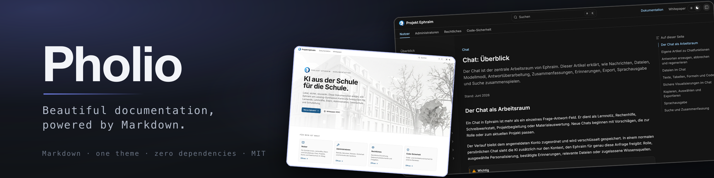

# Pholio – Beautiful documentation, powered by Markdown

[](VERSION)
[](LICENSE)
[](https://www.php.net/releases/8.2/en.php)
[](https://github.com/luka-loehr/pholio/actions/workflows/ci.yml)

**Pholio** turns a folder of Markdown files into a fast, polished documentation site. One theme, done right: light and dark, instant search, highlighted code. No Composer, no npm, no framework, just PHP at build time and static files afterwards.

---

## Features

- **Markdown first**, plus a few component tags: callouts, cards, tabs, steps, file trees, type tables
- **One polished theme** with light and dark mode, sidebar, table of contents and keyboard shortcuts
- **Instant search** built at compile time, no backend
- **Syntax highlighting** at build time, with titles, line numbers and code tabs
- **Zero dependencies**: PHP 8.2 is all you need
- **Static output** that runs on any host, with a ready `.htaccess` for Apache
- **English and German** interface
- **Fails loud**: unknown components, icons or languages stop the build with file and line

---

## Quick start

```bash
curl -fsSL https://raw.githubusercontent.com/luka-loehr/pholio/main/scripts/install.sh | sh
pholio init my-docs
cd my-docs
pholio dev      # http://127.0.0.1:8080
pholio build    # static site in public/
```

Requires PHP 8.2+ with `mbstring` and `ctype` (PCRE2 10.43+ recommended for full syntax highlighting). The installer links `pholio` into `~/.local/bin` and prints the line to add if that folder is not on your `PATH`. More in [Getting started](docs/getting-started.md).

---

## Project structure

```
my-docs/
├── pholio.config.php   optional, every key has a default
├── content/            Markdown pages and meta.json files
├── assets/             images and files, published at /assets/
└── public/             the built site
```

---

## Documentation

- [Getting started](docs/getting-started.md)
- [Content format](docs/content-format.md)
- [Configuration](docs/configuration.md)
- [Architecture](docs/architecture.md)
- [Verification](docs/verification.md)
- [Roadmap](docs/roadmap.md)
- [Demo site](examples/demo/README.md)

---

## License

MIT – [View License](LICENSE)  
Third-party fonts, icons, grammars and design sources keep their own licences: [THIRD_PARTY_NOTICES.md](THIRD_PARTY_NOTICES.md)

---

## Support

- [Report bugs](https://github.com/luka-loehr/pholio/issues)

---

Developed by [Luka Löhr](https://github.com/luka-loehr)
