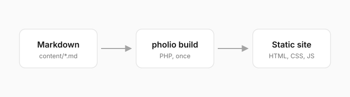

This page uses every component tag and every Markdown construct Pholio
accepts. Each example shows the rendered result first and the source that
produced it underneath. The attributes are listed in
[Content format](/docs/content-format).

<InlineTOC label="On this page" />

````text
<InlineTOC label="On this page" />
````

## Callouts

A callout has a `type` and an optional `title`; its body is Markdown. Without
a type it is `info`.

<Callout>
A callout without a type or a title.
</Callout>

<Callout type="info" title="Info">
Background information that helps but isn't required.
</Callout>

<Callout type="warning" title="Warning">
Something that can go wrong if the reader skips it.
</Callout>

<Callout type="error" title="Error">
Something destructive that can't be undone.
</Callout>

<Callout type="success" title="Success">
What the reader sees when everything worked.
</Callout>

<Callout type="idea" title="Idea">
A suggestion worth trying.
</Callout>

<Callout type="tip" title="Tip">
`tip` is an alias for `info`.
</Callout>

<Callout type="warn" title="Warn">
`warn` is an alias for `warning`.
</Callout>

<Callout type="info" title="Custom icon" icon="rocket">
`icon` replaces the type's icon with any lucide icon.
</Callout>

````text
<Callout>
A callout without a type or a title.
</Callout>

<Callout type="info" title="Info">
Background information that helps but isn't required.
</Callout>

<Callout type="warning" title="Warning">
Something that can go wrong if the reader skips it.
</Callout>

<Callout type="error" title="Error">
Something destructive that can't be undone.
</Callout>

<Callout type="success" title="Success">
What the reader sees when everything worked.
</Callout>

<Callout type="idea" title="Idea">
A suggestion worth trying.
</Callout>

<Callout type="tip" title="Tip">
`tip` is an alias for `info`.
</Callout>

<Callout type="warn" title="Warn">
`warn` is an alias for `warning`.
</Callout>

<Callout type="info" title="Custom icon" icon="rocket">
`icon` replaces the type's icon with any lucide icon.
</Callout>
````

## Cards

Cards group links. Each card can carry a lucide icon; a card without `href` is
static.

<Cards>
  <Card title="Getting started" description="Install Pholio and build a first site." href="/docs/getting-started" icon="rocket" />
  <Card title="Configuration" description="Every key of pholio.config.php." href="/docs/configuration" icon="settings" />
  <Card title="Static" description="A card without a link or an icon." />
  <Card title="With an icon" description="A static card with an icon." icon="sparkles" />
</Cards>

````text
<Cards>
  <Card title="Getting started" description="Install Pholio and build a first site." href="/docs/getting-started" icon="rocket" />
  <Card title="Configuration" description="Every key of pholio.config.php." href="/docs/configuration" icon="settings" />
  <Card title="Static" description="A card without a link or an icon." />
  <Card title="With an icon" description="A static card with an icon." icon="sparkles" />
</Cards>
````

## Tabs

`items` lists the labels, separated by `|`; each `Tab` names its label in
`value`. `defaultIndex` picks the tab that starts open, `updateAnchor` writes
the choice into the URL hash.

<Tabs items="macOS|Linux|Windows" defaultIndex="1" updateAnchor>
<Tab value="macOS">
Run the installer in Terminal.
</Tab>
<Tab value="Linux">
Run the installer in any shell.
</Tab>
<Tab value="Windows">
Use WSL and run the installer there.
</Tab>
</Tabs>

````text
<Tabs items="macOS|Linux|Windows" defaultIndex="1" updateAnchor>
<Tab value="macOS">
Run the installer in Terminal.
</Tab>
<Tab value="Linux">
Run the installer in any shell.
</Tab>
<Tab value="Windows">
Use WSL and run the installer there.
</Tab>
</Tabs>
````

### Grouped tabs

Tabs with the same `groupId` switch together; `persist` remembers the choice
across pages and visits.

<Tabs groupId="package" items="curl|Git" persist>
<Tab value="curl">
```bash
curl -fsSL https://pholio.lukaloehr.com/install.sh | sh
```
</Tab>
<Tab value="Git">
```bash
git clone https://github.com/luka-loehr/pholio.git
```
</Tab>
</Tabs>

<Tabs groupId="package" items="curl|Git" persist>
<Tab value="curl">
The installer links `pholio` into `~/.local/bin`.
</Tab>
<Tab value="Git">
Run `php bin/pholio` from the clone.
</Tab>
</Tabs>

`````text
<Tabs groupId="package" items="curl|Git" persist>
<Tab value="curl">
```bash
curl -fsSL https://pholio.lukaloehr.com/install.sh | sh
```
</Tab>
<Tab value="Git">
```bash
git clone https://github.com/luka-loehr/pholio.git
```
</Tab>
</Tabs>

<Tabs groupId="package" items="curl|Git" persist>
<Tab value="curl">
The installer links `pholio` into `~/.local/bin`.
</Tab>
<Tab value="Git">
Run `php bin/pholio` from the clone.
</Tab>
</Tabs>
`````

## Steps

Each `Step` is numbered; a heading inside it becomes the step's title.

<Steps>
<Step>

### Create a project

```bash
pholio init my-docs
```

</Step>
<Step>

### Write a page

Add a Markdown file below `content/`.

</Step>
<Step>

### Build

```bash
pholio build my-docs
```

</Step>
</Steps>

`````text
<Steps>
<Step>

### Create a project

```bash
pholio init my-docs
```

</Step>
<Step>

### Write a page

Add a Markdown file below `content/`.

</Step>
<Step>

### Build

```bash
pholio build my-docs
```

</Step>
</Steps>
`````

## Accordions

With `type="single"` one item is open at a time; `defaultValue` opens items
at the start. With `type="multiple"` any number can be open at once.

<Accordions type="single" defaultValue="What does Pholio need?">
<Accordion title="What does Pholio need?">
PHP 8.2 with `mbstring` and `ctype`. Nothing else.
</Accordion>
<Accordion title="Where does the output run?">
On any static host. An `.htaccess` for Apache is written alongside.
</Accordion>
<Accordion title="Search">
Built at compile time, ranked in the browser.
</Accordion>
<Accordion title="Agents" id="agents-accordion">
Every page also exists as Markdown, listed in `llms.txt`.
</Accordion>
</Accordions>

````text
<Accordions type="single" defaultValue="What does Pholio need?">
<Accordion title="What does Pholio need?">
PHP 8.2 with `mbstring` and `ctype`. Nothing else.
</Accordion>
<Accordion title="Where does the output run?">
On any static host. An `.htaccess` for Apache is written alongside.
</Accordion>
<Accordion title="Search">
Built at compile time, ranked in the browser.
</Accordion>
<Accordion title="Agents" id="agents-accordion">
Every page also exists as Markdown, listed in `llms.txt`.
</Accordion>
</Accordions>
````

## Files

A file tree with nested folders. `defaultOpen` expands a folder, `disabled`
keeps it closed, `icon` sets a file's icon.

<Files>
  <Folder name="my-docs" defaultOpen>
    <File name="pholio.config.php" icon="settings" />
    <Folder name="content" defaultOpen>
      <File name="index.md" />
      <File name="meta.json" icon="braces" />
      <Folder name="guide">
        <File name="installation.md" />
      </Folder>
    </Folder>
    <Folder name="assets" />
    <Folder name="public" disabled />
  </Folder>
</Files>

````text
<Files>
  <Folder name="my-docs" defaultOpen>
    <File name="pholio.config.php" icon="settings" />
    <Folder name="content" defaultOpen>
      <File name="index.md" />
      <File name="meta.json" icon="braces" />
      <Folder name="guide">
        <File name="installation.md" />
      </Folder>
    </Folder>
    <Folder name="assets" />
    <Folder name="public" disabled />
  </Folder>
</Files>
````

## Type table

Options of an API, with types, defaults and expandable descriptions.

<TypeTable>
  <TypeProp name="title" type="string" required>
  Site name, shown in the header and in `<title>`.
  </TypeProp>
  <TypeProp name="language" type="&quot;en&quot; | &quot;de&quot;" default="&quot;en&quot;" typeDescription="Any other language needs translations" typeDescriptionLink="/docs/configuration">
  Interface language and default search tokenizer.
  </TypeProp>
  <TypeProp name="logo_size" type="number" default="24">
  Logo width and height in pixels.
  </TypeProp>
  <TypeProp name="theme.palette" type="array" deprecated>
  An old key, shown struck through.
  </TypeProp>
</TypeTable>

````text
<TypeTable>
  <TypeProp name="title" type="string" required>
  Site name, shown in the header and in `<title>`.
  </TypeProp>
  <TypeProp name="language" type="&quot;en&quot; | &quot;de&quot;" default="&quot;en&quot;" typeDescription="Any other language needs translations" typeDescriptionLink="/docs/configuration">
  Interface language and default search tokenizer.
  </TypeProp>
  <TypeProp name="logo_size" type="number" default="24">
  Logo width and height in pixels.
  </TypeProp>
  <TypeProp name="theme.palette" type="array" deprecated>
  An old key, shown struck through.
  </TypeProp>
</TypeTable>
````

## Images

### Screenshot with a dark variant

`Screenshot` shows `dark` in the dark color scheme and `src` in the light one.
Switch the theme to see both.

<Screenshot src="./assets/components/pipeline-light.svg" dark="./assets/components/pipeline-dark.svg" alt="Markdown goes through pholio build and comes out as a static site" />

````text
<Screenshot src="./assets/components/pipeline-light.svg" dark="./assets/components/pipeline-dark.svg" alt="Markdown goes through pholio build and comes out as a static site" />
````

### Image zoom

`ImageZoom` opens the image enlarged on click.

<ImageZoom src="./assets/components/pipeline-light.svg" alt="The build pipeline, enlarged on click" width="720" height="200" />

````text
<ImageZoom src="./assets/components/pipeline-light.svg" alt="The build pipeline, enlarged on click" width="720" height="200" />
````

### Markdown image

A plain Markdown image renders as one bordered image, sized from the file.



````text

````

## Code blocks

### Title and line numbers

```ts title="search.ts" lineNumbers
import { createSearch } from './search.js';

const search = createSearch(index);
const hits = search.query('install');
```

`````text
```ts title="search.ts" lineNumbers
import { createSearch } from './search.js';

const search = createSearch(index);
const hits = search.query('install');
```
`````

### Line numbers from another start

```php lineNumbers=40
return [
    'title' => 'My docs',
];
```

`````text
```php lineNumbers=40
return [
    'title' => 'My docs',
];
```
`````

### Highlighted lines and words

```js
// [!code word:query]
const hits = search.query('install');
render(hits); // [!code highlight]
search.query('theme');
```

`````text
```js
// [!code word:query]
const hits = search.query('install');
render(hits); // [!code highlight]
search.query('theme');
```
`````

### Focus

```css
.nd-card {
  border-radius: 12px; /* [!code focus] */
  padding: 16px;
}
```

`````text
```css
.nd-card {
  border-radius: 12px; /* [!code focus] */
  padding: 16px;
}
```
`````

### Added and removed lines

```yaml title="config.yaml"
theme:
  hotkey: d # [!code --]
  hotkey: k # [!code ++]
```

`````text
```yaml title="config.yaml"
theme:
  hotkey: d # [!code --]
  hotkey: k # [!code ++]
```
`````

### Diff language

```diff
- 'language' => 'en',
+ 'language' => 'de',
  'title' => 'Handbuch',
```

`````text
```diff
- 'language' => 'en',
+ 'language' => 'de',
  'title' => 'Handbuch',
```
`````

### Code tabs

Consecutive code blocks with a `tab` attribute are merged into one tab group.

```bash tab="Build"
pholio build
```

```bash tab="Check"
pholio check
```

```bash tab="Dev"
pholio dev
```

`````text
```bash tab="Build"
pholio build
```

```bash tab="Check"
pholio check
```

```bash tab="Dev"
pholio dev
```
`````

### Code as tag content

`DynamicCodeBlock` takes its code verbatim from the tag's content.

<DynamicCodeBlock lang="json">
{
  "title": "Pholio",
  "pages": ["index", "components"]
}
</DynamicCodeBlock>

````text
<DynamicCodeBlock lang="json">
{
  "title": "Pholio",
  "pages": ["index", "components"]
}
</DynamicCodeBlock>
````

## Tables

Columns align left, center or right.

| Command | Writes | Exit code |
| :--- | :---: | ---: |
| `build` | the site | 0 |
| `check` | nothing | 1 on differences |
| `dev` | the site, with drafts | 0 |

````text
| Command | Writes | Exit code |
| :--- | :---: | ---: |
| `build` | the site | 0 |
| `check` | nothing | 1 on differences |
| `dev` | the site, with drafts | 0 |
````

## Text

### Emphasis, code and links

**Bold**, *italic*, ***both***, ~~strikethrough~~, `inline code`, an
[internal link](/docs/configuration) and an
[external link](https://commonmark.org).

````text
**Bold**, *italic*, ***both***, ~~strikethrough~~, `inline code`, an
[internal link](/docs/configuration) and an
[external link](https://commonmark.org).
````

### Hard line breaks

Two trailing spaces end a line  
without starting a new paragraph.

````text
Two trailing spaces end a line··
without starting a new paragraph.
````

The `··` above stands for the two trailing spaces.

### Blockquote

> Write the page you wish you had found the first time.

````text
> Write the page you wish you had found the first time.
````

### Lists

1. Ordered lists count themselves.
2. They nest:
   - an unordered item
   - another one
3. And continue afterwards.

- [x] Task lists
- [ ] with open items

````text
1. Ordered lists count themselves.
2. They nest:
   - an unordered item
   - another one
3. And continue afterwards.

- [x] Task lists
- [ ] with open items
````

### Footnotes

Search runs in a Web Worker[^worker] and needs no backend[^backend].

[^worker]: So typing never blocks the page.
[^backend]: The index is a static JSON file.

````text
Search runs in a Web Worker[^worker] and needs no backend[^backend].

[^worker]: So typing never blocks the page.
[^backend]: The index is a static JSON file.
````

The footnotes are collected at the end of the page.

### Horizontal rule

---

````text
---
````

## Headings

Headings `##` to `####` get anchors and appear in the table of contents. Hover
one to copy its link.

#### A fourth-level heading

````text
## Headings

#### A fourth-level heading
````

## Banner

A `Banner` is an announcement bar across the top of the page, so it sits
outside this showcase. Its source looks like this:

````text
<Banner id="release" variant="rainbow">
Pholio 0.1.0 is out.
</Banner>
````
