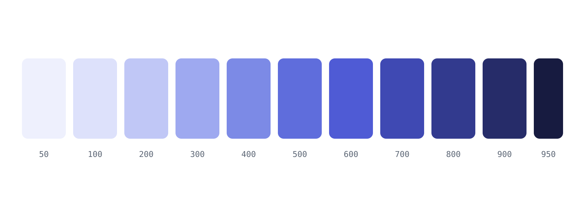

A page is a Markdown file with frontmatter. The title comes from the
frontmatter, so the body starts at `##`.

## Frontmatter

```yaml title="guide/installation.md"
---
title: Installation
description: Install Lanternfly and check that it runs.
icon: download
---
```

## Headings

Use `##` for sections and `###` for subsections. Headings become anchors and
entries in the table of contents on the right.

### A subsection

Ids are derived from the text, so this heading is reachable as
`#a-subsection`.

#### A fourth level

Allowed, but rarely a good idea.

## Links

Link to another page with a relative path, like
[Callouts and cards](./callouts-and-cards), or to the
[reference section](../reference). Broken internal links stop the build.
External links such as [the CommonMark spec](https://spec.commonmark.org)
open in a new tab.

## Images

A plain Markdown image renders as a single bordered picture:



For light and dark variants, use `Screenshot`. For images worth enlarging, use
`ImageZoom`:

<ImageZoom src="color-scale.svg" alt="An indigo colour scale from 50 to 950" width="1600" height="600" />

## Quotes

> Write the page you wish you had found the first time.
