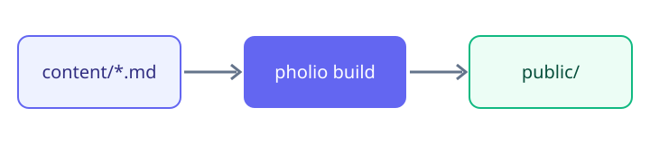

## Frontmatter

Each page starts with a `title` and an optional `description` between two
`---` lines.

## Images

Images live in `assets/`. This one is referenced relative to the page file,
the one on the start page with its published URL. Both work.



## Callouts

<Callout type="info" title="Tip">
Headings become the table of contents on the right.
</Callout>

```bash
pholio build
```
